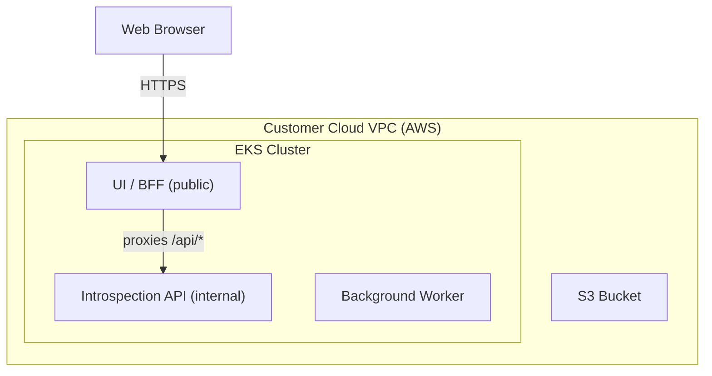

<center>
<h1>Kitchen Sink App</h1>

A comprehensive test application showcasing the full Nuon platform.

Nuon Install Id: {{ .nuon.install.id }}

AWS Region: {{ .nuon.install_stack.outputs.region }}

</center>

## What is this?

The Kitchen Sink App is an introspection and debugging tool that runs inside a customer's cloud account. It exposes details about the Kubernetes cluster, Helm releases, Terraform state, environment variables, and Nuon-specific configuration — all through a web UI and a REST API.

## Architecture



**UI** — public-facing React dashboard at `https://app.{{.nuon.install.sandbox.outputs.nuon_dns.public_domain.name}}`

**API** — internal-only introspection API at `https://api.internal.{{.nuon.install.sandbox.outputs.nuon_dns.internal_domain.name}}`

## Endpoints

| Path | Description |
|------|-------------|
| `/` | Discover all endpoints |
| `/livez` | Liveness probe |
| `/readyz` | Readiness probe |
| `/introspect/kube` | Kubernetes cluster details |
| `/introspect/namespace/:ns` | Namespace details (pods, services, secrets) |
| `/introspect/helm` | Installed Helm charts |
| `/introspect/helm-values/:ns/:name` | Helm release values |
| `/introspect/helm-rendered/:ns/:name` | Rendered Helm manifests |
| `/introspect/env` | Full environment |
| `/introspect/terraform` | Terraform component outputs |
| `/introspect/secrets` | Secret values |
| `/introspect/defaults` | Default values |
| `/introspect/sandbox` | Sandbox details |
| `/introspect/nuon` | Nuon built-in values |
| `/introspect/docker-build` | Docker build component details |
| `/introspect/external-image` | External image component details |

## Testing

```bash
curl https://app.{{.nuon.install.sandbox.outputs.nuon_dns.public_domain.name}}/api/introspect/nuon
```
